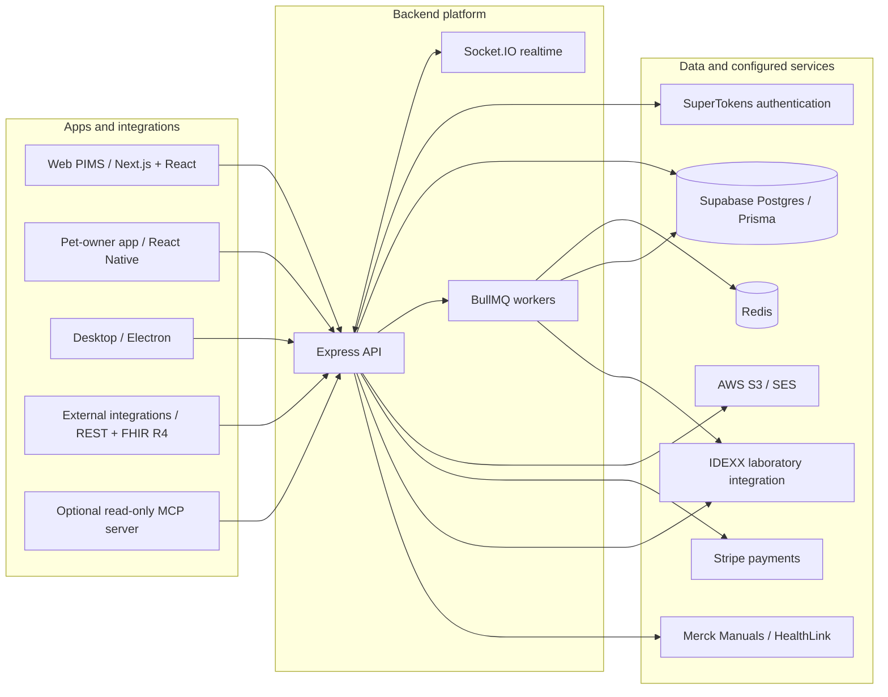

<p align="center">
  <a href="https://yosemitecrew.com/">
    
  </a>
</p>

<h1 align="center">Open-Source Operating System for Animal Health</h1>

<p align="center">
  <strong>Yosemite Crew</strong><br />
  A veterinary PIMS at the core. Connected apps, integrations, and community skills around it.<br />
  Built for veterinary teams, the families they care for, and the developers extending both.
</p>

<p align="center">
  <a href="https://yosemitecrew.com/">Website</a> &middot;
  <a href="#skills-for-users">User skills</a> &middot;
  <a href="#local-development">Developer setup</a> &middot;
  <a href="./CONTRIBUTING.md">Contribute</a> &middot;
  <a href="https://discord.gg/SwM6mX85KD">Community</a>
</p>

[](https://github.com/YosemiteCrew/Yosemite-Crew/actions/workflows/ci.yaml?query=branch%3Adev+event%3Apush)
[](https://github.com/YosemiteCrew/Yosemite-Crew/actions/workflows/supply-chain.yml?query=branch%3Adev+event%3Apush)
[](./License.txt)
[](./.nvmrc)
[](./package.json)
[](https://discord.gg/SwM6mX85KD)

## Product Walkthrough

https://github.com/user-attachments/assets/50209ebc-f966-4916-abb4-d697b5fbf778

## Code Quality (SonarCloud)

| Metric           | Backend                                                                                                                                                                                                                          | Platform (Frontend)                                                                                                                                                                                                                | Mobile App                                                                                                                                                                                                                               | Desktop                                                                                                                                                                                                                          |
| ---------------- | -------------------------------------------------------------------------------------------------------------------------------------------------------------------------------------------------------------------------------- | ---------------------------------------------------------------------------------------------------------------------------------------------------------------------------------------------------------------------------------- | ---------------------------------------------------------------------------------------------------------------------------------------------------------------------------------------------------------------------------------------- | -------------------------------------------------------------------------------------------------------------------------------------------------------------------------------------------------------------------------------- |
| Quality Gate     | [](https://sonarcloud.io/summary/new_code?id=yosemitecrew_Yosemite-Crew_Backend)          | [](https://sonarcloud.io/summary/new_code?id=yosemitecrew_Yosemite-Crew_Frontend)          | [](https://sonarcloud.io/summary/new_code?id=yosemitecrew_Yosemite-Crew_MobileAppYC)          | [](https://sonarcloud.io/summary/new_code?id=yosemitecrew_Yosemite-Crew_Desktop)          |
| Coverage         | [](https://sonarcloud.io/summary/new_code?id=yosemitecrew_Yosemite-Crew_Backend)                         | [](https://sonarcloud.io/summary/new_code?id=yosemitecrew_Yosemite-Crew_Frontend)                         | [](https://sonarcloud.io/summary/new_code?id=yosemitecrew_Yosemite-Crew_MobileAppYC)                         | [](https://sonarcloud.io/summary/new_code?id=yosemitecrew_Yosemite-Crew_Desktop)                         |
| Bugs             | [](https://sonarcloud.io/summary/new_code?id=yosemitecrew_Yosemite-Crew_Backend)                                 | [](https://sonarcloud.io/summary/new_code?id=yosemitecrew_Yosemite-Crew_Frontend)                                 | [](https://sonarcloud.io/summary/new_code?id=yosemitecrew_Yosemite-Crew_MobileAppYC)                                 | [](https://sonarcloud.io/summary/new_code?id=yosemitecrew_Yosemite-Crew_Desktop)                                 |
| Code Smells      | [](https://sonarcloud.io/summary/new_code?id=yosemitecrew_Yosemite-Crew_Backend)                   | [](https://sonarcloud.io/summary/new_code?id=yosemitecrew_Yosemite-Crew_Frontend)                   | [](https://sonarcloud.io/summary/new_code?id=yosemitecrew_Yosemite-Crew_MobileAppYC)                   | [](https://sonarcloud.io/summary/new_code?id=yosemitecrew_Yosemite-Crew_Desktop)                   |
| Reliability      | [](https://sonarcloud.io/summary/new_code?id=yosemitecrew_Yosemite-Crew_Backend)     | [](https://sonarcloud.io/summary/new_code?id=yosemitecrew_Yosemite-Crew_Frontend)     | [](https://sonarcloud.io/summary/new_code?id=yosemitecrew_Yosemite-Crew_MobileAppYC)     | [](https://sonarcloud.io/summary/new_code?id=yosemitecrew_Yosemite-Crew_Desktop)     |
| Security Rating  | [](https://sonarcloud.io/summary/new_code?id=yosemitecrew_Yosemite-Crew_Backend)           | [](https://sonarcloud.io/summary/new_code?id=yosemitecrew_Yosemite-Crew_Frontend)           | [](https://sonarcloud.io/summary/new_code?id=yosemitecrew_Yosemite-Crew_MobileAppYC)           | [](https://sonarcloud.io/summary/new_code?id=yosemitecrew_Yosemite-Crew_Desktop)           |
| Vulnerabilities  | [](https://sonarcloud.io/summary/new_code?id=yosemitecrew_Yosemite-Crew_Backend)           | [](https://sonarcloud.io/summary/new_code?id=yosemitecrew_Yosemite-Crew_Frontend)           | [](https://sonarcloud.io/summary/new_code?id=yosemitecrew_Yosemite-Crew_MobileAppYC)           | [](https://sonarcloud.io/summary/new_code?id=yosemitecrew_Yosemite-Crew_Desktop)           |
| Duplicated Lines | [](https://sonarcloud.io/summary/new_code?id=yosemitecrew_Yosemite-Crew_Backend) | [](https://sonarcloud.io/summary/new_code?id=yosemitecrew_Yosemite-Crew_Frontend) | [](https://sonarcloud.io/summary/new_code?id=yosemitecrew_Yosemite-Crew_MobileAppYC) | [](https://sonarcloud.io/summary/new_code?id=yosemitecrew_Yosemite-Crew_Desktop) |

## Contents

- [Overview](#overview)
- [Who It Is For](#who-it-is-for)
- [Skills for Users](#skills-for-users)
- [Architecture](#architecture)
- [Repository Map](#repository-map)
- [Our Tech Stack](#our-tech-stack)
- [Local Development](#local-development)
- [Security and Quality](#security-and-quality)
- [Documentation](#documentation)
- [Contributing and Community](#contributing-and-community)
- [License](#license)

## Overview

Yosemite Crew is an open-source operating system for animal health, with a veterinary Practice Information Management System (PIMS) at its core.

- **Practice operations:** scheduling, tasks, inventory, billing, and communications.
- **Clinical workflows:** patient records, forms, and connected laboratory workflows.
- **Pet-owner experience:** appointments, records, and communication with participating practices.
- **Developer access:** inspect and extend the source, use documented REST and FHIR-oriented interfaces, or connect a compatible client to the optional MCP server.

## Who It Is For

### Veterinary Teams

Manage appointments, clinical records, inventory, billing, and client messages in the web or desktop PIMS. Use the community skills to compare software, onboard staff, audit exports, and review practice workflows.

### Pet Owners

Access appointments, records, and messages through participating practices in the mobile app. Use the visit-preparation skill to organize observations and questions before an appointment.

### Developers

Extend the apps, build REST/FHIR integrations, or query the developer API through the read-only MCP server. Start with the [repository map](#repository-map), [local setup](#local-development), and [contributor guide](./CONTRIBUTING.md).

## Skills for Users

Use these seven skills in your AI assistant without a Yosemite Crew account, API key, or server. They contain instructions and reference files, not executable scripts or service connectors.

### Choose a Skill

| Skill                                                                         | What to provide                                                  | What you get                                                                                 |
| ----------------------------------------------------------------------------- | ---------------------------------------------------------------- | -------------------------------------------------------------------------------------------- |
| [Veterinary software buyer](./.agents/skills/yosemite-vet-software-buyer/)    | Quotes, contracts, budget, and required workflows                | Requirements, quote comparisons, hidden-clause reviews, and purchase or exit questions       |
| [Staff onboarding and SOPs](./.agents/skills/yosemite-staff-onboarding/)      | Role, approved practice policies, and training schedule          | Induction plans, competency checklists, and SOP drafts                                       |
| [Client communications](./.agents/skills/yosemite-client-communications/)     | Confirmed facts, approved care instructions, and message channel | Reminder, follow-up, estimate-explanation, or complaint-response drafts                      |
| [Data migration audit](./.agents/skills/yosemite-data-migration-audit/)       | Source export, destination sample, and field mapping             | Read-only checks for missing records, broken links, attachment gaps, and balance differences |
| [Inventory planning](./.agents/skills/yosemite-inventory-planning/)           | Stock counts, units, expiry dates, demand, and lead times        | Expiry reviews, count discrepancies, and provisional reorder lists                           |
| [Practice workflow audit](./.agents/skills/yosemite-practice-workflow-audit/) | Process steps, workload, timings, and observed delays            | Process maps, bottlenecks, and measurable improvement plans                                  |
| [Vet visit preparation](./.agents/skills/yosemite-vet-visit-prep/)            | Observations, symptom timeline, medication list, and questions   | A concise veterinary appointment brief                                                       |

### Get Started

1. Open a skill folder and read `SKILL.md`.
2. Install the whole folder, including `references/` and `agents/`, using the instructions below. Compare versions before replacing an existing copy.
3. Invoke the skill with your requested output and the relevant redacted documents. Copy only the user skills you need, not the repository's engineering skills.

<details>
<summary><strong>Codex setup and invocation</strong></summary>

Repository skills are in [`.agents/skills`](./.agents/skills/). For use across projects, copy the selected skill folder to `~/.agents/skills/`. Alternatively, ask `$skill-installer` to install the skill from its GitHub folder link.

Invoke it with `$` and its exact folder name, for example `$yosemite-vet-software-buyer`. See the [skill usage documentation](https://learn.chatgpt.com/docs/build-skills#where-codex-loads-local-skills).

</details>

<details>
<summary><strong>Assistants using .claude/skills</strong></summary>

Matching copies are in [`.claude/skills`](./.claude/skills/). Keep the selected folder in your project's `.claude/skills/`, or copy it to `~/.claude/skills/` for personal use.

Invoke it with `/` and its exact folder name, for example `/yosemite-inventory-planning`, followed by your request. See the [slash-command usage documentation](https://code.claude.com/docs/en/skills#choose-where-skills-load).

</details>

<details>
<summary><strong>Other assistants and manual use</strong></summary>

If your assistant cannot install local skills, attach `SKILL.md` and the relevant reference files to your request. Attach any authorized input documents separately; the skill has no automatic access to your records.

</details>

### Example Requests

For slash-command assistants, replace `$skill-name` with `/skill-name`.

**Before signing a software agreement:**

```text
Use $yosemite-vet-software-buyer to review this redacted agreement.
Check renewal terms, extra fees, data-export rights, and exit costs.
Separate confirmed clauses from unanswered questions. Favor no supplier.
```

**For a practice stock review:**

```text
Use $yosemite-inventory-planning to review this stock sheet.
Flag expiry exposure and missing unit or lead-time information.
Draft a reorder list for review. Do not place orders.
```

**Before a veterinary appointment:**

```text
Use $yosemite-vet-visit-prep to organize my observations and questions
into a short brief for my veterinarian. Do not diagnose or suggest
medication changes.
```

### Independence, Privacy, and Limits

- **Vendor neutrality:** evaluate all suppliers, including Yosemite Crew, by the same criteria. Keeping your existing software or buying nothing remains an option; no sales call is required.
- **Unverified information:** flag missing facts and approvals rather than inventing them. Review drafts before operational use.
- **Professional review:** clinical content needs veterinary review; contracts and regulatory questions need qualified advice. Do not delay urgent veterinary care to prepare a brief.
- **Authorization:** obtain separate approval before sending messages, placing orders, moving records, or signing agreements. Skills do not authorize medication changes.
- **Data handling:** use only information you are authorized to share with the chosen AI service. Redact unnecessary identifiers and credentials, follow practice policy, and keep sensitive records out of public issues and pull requests.

## Architecture



**Persistence:** Prisma owns the PostgreSQL schema and migrations in [`packages/database`](./packages/database/README.md). Enforce application authorization and organization-scoped access when reading or writing practice data. See [ADR 0001](./docs/adr/0001-postgres-prisma-source-of-truth.md).

**Interoperability:** the [router documentation](./apps/frontend/content/docs/apps/backend/routers) lists supported REST/FHIR resources, operations, and authorization requirements.

## Repository Map

This is a TypeScript monorepo managed with pnpm workspaces and Turborepo.

### Applications

| Application                                        | Purpose and implementation                                                                                                       |
| -------------------------------------------------- | -------------------------------------------------------------------------------------------------------------------------------- |
| [`apps/frontend`](./apps/frontend/README.md)       | Staff web PIMS and documentation at `/docs`. Next.js 15, React 19, and Zustand; Storybook, Playwright, and accessibility checks. |
| [`apps/backend`](./apps/backend/README.md)         | Express 4 API on TypeScript, Prisma persistence, Socket.IO realtime, BullMQ workers, Stripe payments, and external integrations. |
| [`apps/mobileAppYC`](./apps/mobileAppYC/README.md) | Pet-owner app using React Native 0.81, Redux Toolkit, and i18next localization, with a local Detox end-to-end harness.           |
| [`apps/desktop`](./apps/desktop/README.md)         | Electron client with electron-builder packaging, signing and notarization configuration, and electron-updater for app updates.   |

### Shared Packages

| Package                                                        | Responsibility                                                                                                 |
| -------------------------------------------------------------- | -------------------------------------------------------------------------------------------------------------- |
| [`@yosemite-crew/database`](./packages/database/README.md)     | Prisma schema, migrations, and database access helpers. The persistence schema's source of truth.              |
| [`@yosemite-crew/auth`](./packages/auth)                       | Provider-neutral authentication boundary, backed by SuperTokens, with session and MFA integration.             |
| [`@yosemite-crew/types`](./packages/types)                     | Shared domain models, forms, and API data-transfer types for web, mobile, and backend.                         |
| [`@yosemite-crew/fhir`](./packages/fhir)                       | Helpers for working with FHIR R4 resource representations.                                                     |
| [`@yosemite-crew/fhirtypes`](./packages/fhirtypes)             | TypeScript definitions for FHIR resources and common clinical data structures.                                 |
| [`@yosemite-crew/lib`](./packages/lib)                         | Cross-workspace utilities, shared error handling, and clinical PDF generation.                                 |
| [`@yosemite-crew/mcp-server`](./packages/mcp-server/README.md) | Optional MCP interface to selected read-only developer API operations, authenticated with a developer API key. |

Skills live in [`.agents/skills`](./.agents/skills/) and [`.claude/skills`](./.claude/skills/). Contributor instructions are in [AGENTS.md](./AGENTS.md).

## Our Tech Stack

- **Language and workspace:** TypeScript, pnpm workspaces, and Turborepo for shared code, dependency management, and task orchestration.
- **Web:** Next.js and React, with Zustand for client state; Storybook and Chromatic for component review, and Playwright for end-to-end and accessibility checks.
- **Backend:** Express, Socket.IO for realtime updates, and BullMQ backed by Redis for background work.
- **Data:** Supabase Postgres with Prisma for schema management, migrations, and database access.
- **Authentication:** SuperTokens behind the shared authentication package's provider-neutral interface.
- **Mobile:** React Native, Redux Toolkit, and i18next, with native Android/iOS tooling and Detox for local end-to-end checks.
- **Desktop:** Electron, electron-builder, and electron-updater for the desktop application and its release packaging.
- **Payments:** Stripe integration for configured payment workflows.
- **Cloud services:** AWS S3 for object storage and SES for email; Pinpoint SDK is also listed in the backend dependencies.
- **Clinical interoperability:** FHIR R4 resource shapes alongside application REST endpoints; IDEXX laboratory integration and Merck Manuals / HealthLink content integration.
- **AI integration:** An optional read-only MCP server for developer API access, plus standalone user skills that do not require it.

Dependency manifests: [web](./apps/frontend/package.json), [backend](./apps/backend/package.json), [mobile](./apps/mobileAppYC/package.json), [desktop](./apps/desktop/package.json), and [lockfile](./pnpm-lock.yaml). Configure provider accounts, credentials, and permissions before using Stripe, AWS, IDEXX, or Merck integrations.

## Local Development

Contributions target `dev`; `main` is the release branch. For skills only, use [skill installation](#get-started) instead.

### 1. Prepare the Toolchain

- Git
- **Node.js 22**, as specified in [`.nvmrc`](./.nvmrc)
- **pnpm 8.15.6**, pinned in [`package.json`](./package.json)
- A dedicated development PostgreSQL database, Redis, and the authentication and external-service configuration required for the workflows you will run

### 2. Clone and Install

Contributors should fork first and substitute their fork URL in the clone command.

```shell
git clone --branch dev https://github.com/YosemiteCrew/Yosemite-Crew.git
cd Yosemite-Crew
pnpm install --frozen-lockfile
```

Dependency installation sets up the repository's Git hooks. Keep secret scanning, formatting, commit-message checks, and pre-push checks enabled.

### 3. Configure Services

For a **fresh checkout only**, copy the example environment files and fill in the values required for your environment. Do not overwrite existing local files or commit secrets.

```shell
cp apps/backend/.env.example apps/backend/.env
cp apps/frontend/.env.example apps/frontend/.env
```

Configure PostgreSQL, Redis, authentication, and the integrations you will use. Make `DATABASE_URL` and `DIRECT_URL` available in the shell that runs Prisma commands; app-specific `.env` files are not automatically loaded by every workspace command. Never use production credentials for local setup.

Use separate PostgreSQL databases for the application and a self-hosted SuperTokens core. Stream chat is optional for local work: leaving its two server credentials blank keeps the API bootable and records the upload-policy control as skipped, while chat operations remain unavailable until configured.

Generate the Prisma client:

```shell
pnpm --filter @yosemite-crew/database run prisma:generate
```

Before applying migrations, follow the [database setup and baseline guidance](./packages/database/README.md). Check migration history first for any existing or restored database.

The repository does not currently provide a Docker Compose setup. Use the pnpm workflow above and provision PostgreSQL and Redis separately.

### 4. Start the Web App and API

```shell
pnpm run dev --filter frontend --filter backend
```

The default web address is `http://localhost:3000`; the backend example uses port `4000`. Keep API URLs and authentication origins consistent with your environment. To run one app, use `pnpm --filter frontend run dev` or `pnpm --filter backend run dev`.

<details>
<summary><strong>Mobile, desktop, and MCP setup</strong></summary>

**Mobile:** follow the [mobile setup guide](./apps/mobileAppYC/README.md) and [`config-templates`](./apps/mobileAppYC/config-templates). Mobile uses `variables.local.ts` and native configuration, not the web/backend `.env` files. Install the appropriate Android or iOS toolchain first.

Start Metro:

```shell
pnpm --filter mobileAppYC run start
```

In a separate terminal, start the platform you configured:

```shell
pnpm --filter mobileAppYC run android
# Or: pnpm --filter mobileAppYC run ios
```

**Desktop:** use the [desktop setup and packaging guide](./apps/desktop/README.md).

**MCP:** use the [MCP server guide](./packages/mcp-server/README.md) for read-only developer API access.

</details>

### 5. Validate Your Changes

Follow [CONTRIBUTING.md](./CONTRIBUTING.md) and [AGENTS.md](./AGENTS.md) for the affected workspace's checks and targeted tests. Root `pnpm run lint` and `pnpm run type-check` also run on pre-push.

`pnpm run verify` runs lint, type-check, tests, and builds. CI also checks security, accessibility, end-to-end workflows, and releases; required checks are documented in the [CI runbook](./docs/ci/required-checks-migration.md).

## Security and Quality

**Report suspected vulnerabilities privately through [SECURITY.md](./SECURITY.md), not in a public issue.** Never include credentials, client records, or patient records in bug reports. Request development or staging access from maintainers through a secure channel.

| Area                   | Checks and tooling                                                                     |
| ---------------------- | -------------------------------------------------------------------------------------- |
| Code quality           | Per-app SonarCloud analysis, TypeScript, linting, and CodeQL                           |
| Automated tests        | Workspace unit and component tests, coverage checks, and targeted regression tests     |
| Web experience         | Playwright end-to-end and accessibility checks; Storybook and Chromatic for components |
| Mobile experience      | A Detox harness for local end-to-end checks                                            |
| Supply chain           | Dependency review, SBOM generation, vulnerability scanning, and license checks         |
| Secret protection      | Staged-secret scanning and CI secret checks                                            |
| Contribution standards | Conventional commits, PR title validation, and required review workflows               |

Contribution requirements: [engineering standards](./docs/engineering-standards.md) and [required CI checks](./docs/ci/required-checks-migration.md).

## Documentation

| Resource                                                                          | What it covers                                                   |
| --------------------------------------------------------------------------------- | ---------------------------------------------------------------- |
| [Developer documentation](./apps/frontend/content/docs)                           | Platform and API documentation, served by the web app at `/docs` |
| [User skills](#skills-for-users)                                                  | Standalone workflows for buyers, practice teams, and pet owners  |
| [Database guide](./packages/database/README.md)                                   | Prisma setup, migrations, and existing-database precautions      |
| [MCP server guide](./packages/mcp-server/README.md)                               | Optional read-only developer API tools                           |
| [Architecture guides](./docs/guide)                                               | Platform design, realtime, notifications, and analytics          |
| [Architecture decisions](./docs/adr)                                              | Recorded technical decisions and their context                   |
| [Engineering wiki](https://github.com/YosemiteCrew/Yosemite-Crew/wiki)            | Additional engineering reference material                        |
| [Design files](https://www.figma.com/design/NAAV4XGcJ6FlGXGK68AUbp/Yosemite-Crew) | Shared product design workspace                                  |
| [DeepWiki](https://deepwiki.com/YosemiteCrew/Yosemite-Crew)                       | An AI-generated codebase tour; verify details against the source |

## Contributing and Community

Contributions can be code, documentation, tests, translations, or improvements to a user skill. Start with [CONTRIBUTING.md](./CONTRIBUTING.md), check [existing issues](https://github.com/YosemiteCrew/Yosemite-Crew/issues), and target pull requests at `dev`.

For skill improvements, keep recommendations vendor-neutral, protect sensitive information, and use fictional or redacted examples. Keep corresponding `.agents/skills` and `.claude/skills` copies in sync, including their supporting files.

- **Questions and discussion:** [Discord](https://discord.gg/SwM6mX85KD)
- **Project news:** [LinkedIn](https://www.linkedin.com/company/yosemitecrew/)
- **Community updates:** [Instagram](https://www.instagram.com/yosemite_crew) and [TikTok](https://www.tiktok.com/@yosemitecrew)
- **Source and releases:** [GitHub](https://github.com/YosemiteCrew/Yosemite-Crew) and [release history](https://github.com/YosemiteCrew/Yosemite-Crew/releases)

Thank you to everyone contributing code, reporting issues, improving documentation, and sharing the project.

<a href="https://github.com/YosemiteCrew/Yosemite-Crew/graphs/contributors">
  
</a>

<details>
<summary><strong>Project growth</strong></summary>

[](https://star-history.com/#YosemiteCrew/Yosemite-Crew&Date)

Browse the project's [stargazers](https://github.com/YosemiteCrew/Yosemite-Crew/stargazers) and [forks](https://github.com/YosemiteCrew/Yosemite-Crew/network/members).

</details>

## License

Yosemite Crew is released under the **GNU Affero General Public License v3.0**, with a Yosemite Crew licensing exception that permits combining the program with works under CC-BY-3.0 and CC-BY-4.0.

The YOSEMITE CREW name, logo, and branding are **not** covered by the open-source license. Commercial use of the branding requires a separate commercial license. See [License.txt](./License.txt) for the full terms.
