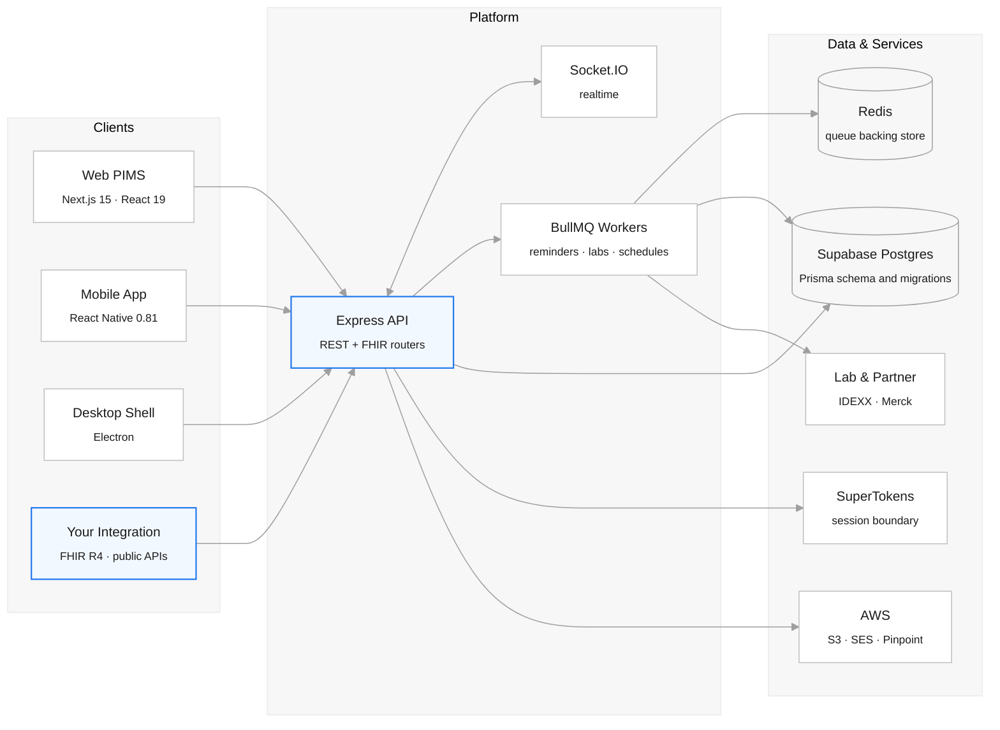

<p align="center">
  <a href="https://yosemitecrew.com/">
    
  </a>
</p>

<h1 align="center">Yosemite Crew</h1>

<p align="center">
  <b>Open-source veterinary practice management</b><br />
  Web, mobile, desktop, integrations, and practical AI skills for the veterinary community.
</p>

<p align="center">
  For veterinary teams, pet owners, and developers.
</p>

<div align="center">

[](https://yosemitecrew.com/) [](https://github.com/YosemiteCrew/Yosemite-Crew/blob/main/CONTRIBUTING.md) [](https://github.com/YosemiteCrew/Yosemite-Crew/tree/main?tab=License-1-ov-file) [](https://www.figma.com/design/NAAV4XGcJ6FlGXGK68AUbp/Yosemite-Crew?node-id=0-1&t=qCMi0h3RReIRMkrK-1) [](https://discord.gg/SwM6mX85KD) [](https://deepwiki.com/YosemiteCrew/Yosemite-Crew)

</div>
<br>

https://github.com/user-attachments/assets/50209ebc-f966-4916-abb4-d697b5fbf778

<br>

# 📖 Contents

- [Overview](#-overview)
- [Who It Is For](#-who-it-is-for)
- [Skills for Users](#skills-for-users)
- [Architecture](#-architecture)
- [Inside the Monorepo](#-inside-the-monorepo)
- [Installation](#-installation)
- [Our Tech Stack](#-our-tech-stack)
- [Engineering Quality](#-engineering-quality)
- [Documentation](#-documentation)
- [Dev Environment Access](#-dev-environment-access)
- [Join Our Growing Community](#-join-our-growing-community)
- [License](#-license)

<br>

# 📝 Overview

Yosemite Crew is an open-source veterinary Practice Information Management System (PIMS). This repository contains the staff-facing web app, pet-owner mobile app, desktop client, backend API, and shared packages for integrations.

The platform covers scheduling, clinical records, forms, tasks, inventory, billing, and communications. Developers can inspect and extend the code and use documented REST and FHIR-oriented interfaces. Available workflows depend on the deployed version, configuration, permissions, and connected services.

The [user skills](#skills-for-users) are a separate collection of reusable AI instructions for buying software, running a practice, and preparing for veterinary visits. They work without a Yosemite Crew account, API key, or running application. Your chosen AI assistant may have its own account requirements and charges.

For platform development, follow [Installation](#-installation). Development contributions target `dev`; `main` is the release branch. Running the platform also requires infrastructure and service configuration, not just cloning the source. See [License](#-license) for software and branding terms.

<br>

# 👥 Who It Is For

<table>
<tr>
<td width="33%" valign="top">

### 🐾 Pet Owners

Use the mobile app for appointments, records, and communication with participating practices, subject to the services they enable.

Use the standalone visit-preparation skill to organize observations, medication information, and questions for your veterinary team.

</td>
<td width="33%" valign="top">

### 🏥 Clinics & Providers

Use the web or desktop PIMS for practice operations, or extend the source to fit your team's requirements.

Use the community skills for software evaluation, staff onboarding, client messages, migration checks, stock planning, and workflow reviews, regardless of your current software supplier.

Deployment, access controls, backups, and compliance with local requirements remain responsibilities to assess and maintain. Open source is not a compliance certification or a guarantee against vendor lock-in.

</td>
<td width="33%" valign="top">

### 💻 Developers

Contribute to the apps and shared packages, or build against the documented API surfaces.

The [MCP server](./packages/mcp-server/README.md) exposes selected read-only developer API tools to compatible AI clients. It is a separate integration, not required by the user skills.

Start with the [contributor guide](./CONTRIBUTING.md), app-specific READMEs, and [developer documentation](./apps/frontend/content/docs).

</td>
</tr>
</table>

<br>

# Skills for Users

Skills give a compatible AI assistant a repeatable workflow, relevant checklists, and clear limits. These seven skills are for veterinary teams, software buyers, and pet owners, not just developers. You can use them with your own documents and spreadsheets without installing the Yosemite Crew application.

### Choose a Skill

| Skill                                                                         | Who it helps                                           | What you can produce                                                                                                 |
| ----------------------------------------------------------------------------- | ------------------------------------------------------ | -------------------------------------------------------------------------------------------------------------------- |
| [Veterinary software buyer](./.agents/skills/yosemite-vet-software-buyer/)    | Owners and managers evaluating any veterinary software | Requirements, demo questions, quote comparisons, hidden-clause reviews, and purchase or exit decisions               |
| [Staff onboarding and SOPs](./.agents/skills/yosemite-staff-onboarding/)      | Managers and team leads                                | Role-specific induction plans, competency checklists, and procedures based on approved practice policies             |
| [Client communications](./.agents/skills/yosemite-client-communications/)     | Reception and clinical teams                           | Reminders, estimate explanations, complaint responses, and follow-ups from confirmed facts and approved instructions |
| [Data migration audit](./.agents/skills/yosemite-data-migration-audit/)       | Teams changing systems                                 | Read-only checks for missing records, duplicate IDs, broken links, attachment gaps, and balance differences          |
| [Inventory planning](./.agents/skills/yosemite-inventory-planning/)           | Stock leads and practice managers                      | Expiry reviews, count discrepancies, and provisional reorder lists using confirmed units, demand, and lead times     |
| [Practice workflow audit](./.agents/skills/yosemite-practice-workflow-audit/) | Owners, managers, and operational teams                | Process maps, evidence-backed bottlenecks, and small measurable improvements, including no-purchase options          |
| [Vet visit preparation](./.agents/skills/yosemite-vet-visit-prep/)            | Pet owners                                             | A concise appointment brief with observations, reported medications, history, and questions                          |

### Use a Skill

1. Open the linked folder and read `SKILL.md`. Keep the **whole folder**, including any `references/` and `agents/` files, when downloading or copying a skill.
2. Load it in your assistant using the locations below. Copy only the user skills you need, not the repository's unrelated engineering skills. If a folder with the same name already exists, compare versions before replacing it.
3. Ask for a specific outcome and provide the minimum relevant information. Start with fictional or redacted examples when possible. Review the result and resolve missing facts before using it operationally.

**Codex:** repository skills live in [`.agents/skills`](./.agents/skills/). For use across your own projects, copy the selected folder to `~/.agents/skills/`; alternatively, ask `$skill-installer` to install it from its GitHub folder link. Mention the skill with `$` in your prompt. See the [Codex usage documentation](https://learn.chatgpt.com/docs/build-skills#where-codex-loads-local-skills).

**Assistants using `.claude/skills`:** matching copies live in [`.claude/skills`](./.claude/skills/). Copy a selected folder to `~/.claude/skills/` for personal use, or keep it in your project's `.claude/skills/`. Invoke it with `/skill-name`. See the [slash-command usage documentation](https://code.claude.com/docs/en/skills#choose-where-skills-load).

**Other assistants:** if local skill installation is not supported, you can supply `SKILL.md` and the relevant reference files as task instructions. This does not install a connector or automatically grant access to your records. Compatibility and file-handling features depend on the assistant.

Example Codex prompts, after installing the relevant skill:

```text
Use $yosemite-vet-software-buyer to review this redacted software agreement for renewal terms, extra fees, data-export rights, and exit costs. Do not favor any supplier.

Use $yosemite-staff-onboarding to build a receptionist onboarding plan from these approved policies. Keep missing approvals visible.

Use $yosemite-inventory-planning to review this stock sheet for expiry exposure and draft a reorder list. Do not place orders.

Use $yosemite-vet-visit-prep to organize my observations and questions into a brief for my veterinarian. Do not diagnose or suggest medication changes.
```

For slash-command invocation, begin with the corresponding command, such as `/yosemite-inventory-planning`, followed by your request. The skill folder name is the invocation name in the examples above.

### Independence and Safe Use

Yosemite Crew publishes these skills, but supplier recommendations must be impartial, including when Yosemite Crew itself is evaluated. The skills do not require using our software, include sales calls, or award preference for affiliation. Improving an existing process or buying nothing can be the appropriate outcome.

These are instruction-based assistants, not clinical, legal, or regulatory certifications. Clinical content needs the appropriate veterinary review; an urgent concern takes priority over preparing a document. Drafting does not authorize sending messages, buying stock, changing medication, moving records, or signing agreements. Unknown information must stay visible rather than becoming an invented fact.

Only provide data you are authorized to use in the chosen AI service. Remove unnecessary identifiers and credentials, check your practice's data-handling rules, and keep sensitive outputs out of public issues and pull requests. These seven skills contain no executable scripts or required service connectors.

<br>

# 🏛 Architecture

The web, mobile, and desktop clients use the backend API. External integrations use the documented API routes; the optional MCP server wraps selected developer data endpoints. The standalone user skills are not connected to these services by default.



**Postgres is the persistence source of truth.** Prisma owns the schema and migrations in [`packages/database`](./packages/database/README.md). Access also depends on application authorization and organization-scoped queries; database technology alone does not guarantee isolation. See [ADR 0001](./docs/adr/0001-postgres-prisma-source-of-truth.md).

**FHIR-oriented interfaces use FHIR R4 resource shapes** alongside application REST endpoints. Check the [router documentation](./apps/frontend/content/docs/apps/backend/routers) for the resources, operations, and authorization each integration actually supports; do not assume complete FHIR conformance from the label alone.

<br>

# 🗂 Inside the Monorepo

A pnpm + Turborepo workspace. Apps ship; packages are the shared spine underneath them.

### Apps

| App                | What it is                                                                                                 |
| ------------------ | ---------------------------------------------------------------------------------------------------------- |
| `apps/frontend`    | Web PIMS and developer documentation at `/docs`. Next.js 15, React 19, Zustand, Storybook, and Playwright. |
| `apps/backend`     | The API. Express 4 on TypeScript, Prisma, Socket.IO realtime, BullMQ workers, Stripe.                      |
| `apps/mobileAppYC` | The pet parent app. React Native 0.81, Redux, i18next localization, Detox end-to-end.                      |
| `apps/desktop`     | The desktop shell. Electron, packaged by electron-builder, notarized, with auto-update.                    |

### Packages

| Package                     | What it holds                                                 |
| --------------------------- | ------------------------------------------------------------- |
| `@yosemite-crew/database`   | The Prisma schema and migrations. The schema source of truth. |
| `@yosemite-crew/auth`       | Provider-independent session boundary built on SuperTokens.   |
| `@yosemite-crew/types`      | Shared domain and form types across web, mobile, and API.     |
| `@yosemite-crew/fhir`       | FHIR R4 helpers.                                              |
| `@yosemite-crew/fhirtypes`  | FHIR R4 resource type definitions.                            |
| `@yosemite-crew/lib`        | Cross-workspace utilities.                                    |
| `@yosemite-crew/mcp-server` | MCP server mounting the developer data plane.                 |

The [`.agents/skills`](./.agents/skills/) and [`.claude/skills`](./.claude/skills/) directories contain both community user skills and repository engineering guidance. The seven user-facing skills are listed [above](#skills-for-users); contributor instructions start in [AGENTS.md](./AGENTS.md).

<br>

# 💻 Installation

### Prerequisites

- Git
- Node.js 22 (see [`.nvmrc`](./.nvmrc))
- pnpm 8.15.6 (pinned by `packageManager` in [`package.json`](./package.json))
- PostgreSQL, Redis, and the authentication/service configuration needed for the app you are running

The [user skills](#skills-for-users) do not need any of these application dependencies. The steps below are for platform development, not a production deployment guide.

### Clone and Install

Clone the development branch. Contributors should fork first and substitute their fork URL in the clone command; pull requests target `dev`.

```shell
git clone --branch dev https://github.com/YosemiteCrew/Yosemite-Crew.git
cd Yosemite-Crew
pnpm install --frozen-lockfile
```

Git hooks are installed during dependency installation. Keep the staged-secret, formatting, commit-message, and pre-push checks enabled.

### Configure Services

For a fresh checkout, copy the example files and fill in the configuration required for your environment. Do not overwrite an existing local configuration or commit secrets.

```shell
cp apps/backend/.env.example apps/backend/.env
cp apps/frontend/.env.example apps/frontend/.env
```

The examples are starting points, not a provisioned environment. Configure the backend's PostgreSQL connection, Redis, authentication, and any services used by the workflows you intend to exercise. Set `DATABASE_URL` and `DIRECT_URL` for Prisma commands in the invoking shell; app-specific environment files are not automatically loaded by every workspace command. Use a dedicated development database, never production credentials for local setup.

Generate the Prisma client after installing dependencies:

```shell
pnpm --filter @yosemite-crew/database run prisma:generate
```

Before applying migrations, read the [database setup and baseline guidance](./packages/database/README.md). An existing or restored database needs its migration history checked before replaying migrations. The legacy root [`docker-compose.yml`](./docker-compose.yml) refers to removed app directories and does not provision PostgreSQL or Redis; it is not a working local setup.

### Run the Apps

After service configuration, start the web app and API from the repository root:

```shell
pnpm run dev --filter frontend --filter backend
```

To run only one app, use `pnpm --filter frontend run dev` or `pnpm --filter backend run dev`. The default web address is `http://localhost:3000`; the backend example uses port `4000`. Keep the frontend API URL and authentication origins consistent with your environment.

Mobile setup uses `variables.local.ts` and native configuration from [`config-templates`](./apps/mobileAppYC/config-templates), not the web/backend `.env` files. Follow the [mobile setup guide](./apps/mobileAppYC/README.md), including the Android or iOS toolchain, before running Metro and a platform build in separate terminals:

```shell
pnpm --filter mobileAppYC run start
```

```shell
# Choose the platform you configured.
pnpm --filter mobileAppYC run android
# Or: pnpm --filter mobileAppYC run ios
```

For the desktop app, follow its [setup and packaging guide](./apps/desktop/README.md). For the optional AI-to-API integration, follow the [MCP server guide](./packages/mcp-server/README.md); user skills do not need it.

### Validate a Change

Start with the checks and targeted tests for the affected workspace in [CONTRIBUTING.md](./CONTRIBUTING.md) and [AGENTS.md](./AGENTS.md). Root `pnpm run lint` and `pnpm run type-check` also run on pre-push. `pnpm run verify` runs the broader lint, type-check, test, and build sequence; it is not a substitute for CI's security, accessibility, end-to-end, or release checks.

<br>

# 🚀 Our Tech Stack

- [TypeScript](https://www.typescriptlang.org/) for type safety
- [Turborepo](https://turbo.build) and [PNPM Workspaces](https://pnpm.io/workspaces) for a powerful monorepo structure and efficient build system
- [Express](https://expressjs.com/) as a backend framework, with [Supabase](https://supabase.com/) Postgres and [Prisma](https://www.prisma.io/) for data storage and migrations
- [BullMQ](https://docs.bullmq.io/) on [Redis](https://redis.io/) for background jobs, and [Socket.IO](https://socket.io/) for realtime updates
- [Next.js](https://nextjs.org/) and [React](https://reactjs.org/) for the frontend, with [Zustand](https://zustand.docs.pmnd.rs/) for state management
- [React Native](https://reactnative.dev/) for mobile app development, and [Electron](https://www.electronjs.org/) for the desktop shell
- [FHIR R4](https://hl7.org/fhir/R4/) for clinical interoperability
- [Stripe](https://stripe.com/) for payments
- [AWS](https://aws.amazon.com) to ensure reliable and scalable cloud infrastructure

<br>

# ✅ Engineering Quality

The repository defines workspace checks, security scans, and review workflows. CI selects affected workspaces and conditionally runs relevant suites; inspect the checks for the specific commit rather than treating a badge as proof that every suite ran.

| Gate                | What it enforces                                                                                             |
| ------------------- | ------------------------------------------------------------------------------------------------------------ |
| **Static analysis** | SonarCloud quality gate per app (see the table below), plus CodeQL scanning.                                 |
| **Types & lint**    | Repo-wide `type-check` and `lint`, enforced again on pre-push.                                               |
| **Tests**           | Unit and component suites per workspace, with coverage held on touched files.                                |
| **Accessibility**   | A dedicated accessibility suite and Playwright a11y run on the web app.                                      |
| **End-to-end**      | Playwright on the web app, enforced in CI. A Detox harness is available for the mobile app and runs locally. |
| **Visual review**   | Storybook and Chromatic for the component library.                                                           |
| **Supply chain**    | Dependency review, SBOM/vulnerability/license workflows, and staged-secret scanning.                         |
| **Governance**      | Conventional commits and PR title validation.                                                                |

## Code Quality (SonarCloud)

[](https://sonarcloud.io/summary/new_code?id=yosemitecrew_Yosemite-Crew_Frontend)

| Metric       | Backend                                                                                                                                                                                                                      | Platform (Frontend)                                                                                                                                                                                                            | Mobile App                                                                                                                                                                                                                           | Desktop                                                                                                                                                                                                                      |
| ------------ | ---------------------------------------------------------------------------------------------------------------------------------------------------------------------------------------------------------------------------- | ------------------------------------------------------------------------------------------------------------------------------------------------------------------------------------------------------------------------------ | ------------------------------------------------------------------------------------------------------------------------------------------------------------------------------------------------------------------------------------ | ---------------------------------------------------------------------------------------------------------------------------------------------------------------------------------------------------------------------------- |
| Quality Gate | [](https://sonarcloud.io/summary/new_code?id=yosemitecrew_Yosemite-Crew_Backend)      | [](https://sonarcloud.io/summary/new_code?id=yosemitecrew_Yosemite-Crew_Frontend)      | [](https://sonarcloud.io/summary/new_code?id=yosemitecrew_Yosemite-Crew_MobileAppYC)      | [](https://sonarcloud.io/summary/new_code?id=yosemitecrew_Yosemite-Crew_Desktop)      |
| Coverage     | [](https://sonarcloud.io/summary/new_code?id=yosemitecrew_Yosemite-Crew_Backend)                     | [](https://sonarcloud.io/summary/new_code?id=yosemitecrew_Yosemite-Crew_Frontend)                     | [](https://sonarcloud.io/summary/new_code?id=yosemitecrew_Yosemite-Crew_MobileAppYC)                     | [](https://sonarcloud.io/summary/new_code?id=yosemitecrew_Yosemite-Crew_Desktop)                     |
| Bugs         | [](https://sonarcloud.io/summary/new_code?id=yosemitecrew_Yosemite-Crew_Backend)                             | [](https://sonarcloud.io/summary/new_code?id=yosemitecrew_Yosemite-Crew_Frontend)                             | [](https://sonarcloud.io/summary/new_code?id=yosemitecrew_Yosemite-Crew_MobileAppYC)                             | [](https://sonarcloud.io/summary/new_code?id=yosemitecrew_Yosemite-Crew_Desktop)                             |
| Code Smells  | [](https://sonarcloud.io/summary/new_code?id=yosemitecrew_Yosemite-Crew_Backend)               | [](https://sonarcloud.io/summary/new_code?id=yosemitecrew_Yosemite-Crew_Frontend)               | [](https://sonarcloud.io/summary/new_code?id=yosemitecrew_Yosemite-Crew_MobileAppYC)               | [](https://sonarcloud.io/summary/new_code?id=yosemitecrew_Yosemite-Crew_Desktop)               |
| Reliability  | [](https://sonarcloud.io/summary/new_code?id=yosemitecrew_Yosemite-Crew_Backend) | [](https://sonarcloud.io/summary/new_code?id=yosemitecrew_Yosemite-Crew_Frontend) | [](https://sonarcloud.io/summary/new_code?id=yosemitecrew_Yosemite-Crew_MobileAppYC) | [](https://sonarcloud.io/summary/new_code?id=yosemitecrew_Yosemite-Crew_Desktop) |

- Contributor workflow: [CONTRIBUTING.md](./CONTRIBUTING.md)
- Security reporting: [SECURITY.md](./SECURITY.md)
- Engineering standards: [docs/engineering-standards.md](./docs/engineering-standards.md)
- Architecture decisions: [docs/adr](./docs/adr)
- AI/automation contribution policy: [AGENTS.md](./AGENTS.md)

<br>

# 📚 Documentation

| Where                                                                  | What you will find                                                     |
| ---------------------------------------------------------------------- | ---------------------------------------------------------------------- |
| [Developer docs](./apps/frontend/content/docs)                         | The documentation, served at /docs for platform and API documentation. |
| [Skills for users](#skills-for-users)                                  | Seven standalone workflows for buyers, practice teams, and pet owners. |
| [MCP server](./packages/mcp-server/README.md)                          | Optional read-only access to selected developer API operations.        |
| [Database setup](./packages/database/README.md)                        | Prisma migrations and existing-database baseline precautions.          |
| [Engineering wiki](https://github.com/YosemiteCrew/Yosemite-Crew/wiki) | The structured engineering knowledge base.                             |
| [Architecture guides](./docs/guide)                                    | PIMS architecture, realtime, notifications, analytics.                 |
| [Architecture decisions](./docs/adr)                                   | The record of why the platform is shaped as it is.                     |
| [DeepWiki](https://deepwiki.com/YosemiteCrew/Yosemite-Crew)            | An AI-generated tour of the codebase.                                  |

<br>

# 🔑 Dev Environment Access

Request current dev or staging access from the maintainers through a secure channel. Do not publish shared credentials in repository documentation.

<br>

# 💬 Join Our Growing Community

- Star our repo and show your support!
- [Tik-tok](https://www.tiktok.com/@yosemitecrew) and [Instagram](https://www.instagram.com/yosemite_crew) for memes
- Follow us on [LinkedIn](https://www.linkedin.com/company/yosemitecrew/) to get all the latest news
- Join our [Discord](https://discord.com/invite/SwM6mX85KD) to chat with fellow contributors and users
- [Contribute](https://github.com/YosemiteCrew/Yosemite-Crew/blob/main/CONTRIBUTING.md) - we love contributions! Whether it's code, docs, or ideas, your help is always welcome!

<br>

# 📜 License

Yosemite Crew is released under the **GNU Affero General Public License v3.0**, with a Yosemite Crew licensing exception that permits combining the program with works under CC-BY-3.0 and CC-BY-4.0.

The YOSEMITE CREW name, logo, and branding are **not** covered by the open source license. Commercial use of the branding requires a separate commercial license. See [License.txt](./License.txt) for the full terms.

<br>

# ⭐ Star History

<a href="https://star-history.com/#YosemiteCrew/Yosemite-Crew&Date">
 <picture>
   <source media="(prefers-color-scheme: dark)" srcset="https://api.star-history.com/svg?repos=YosemiteCrew/Yosemite-Crew&type=Date&theme=dark" />
   <source media="(prefers-color-scheme: light)" srcset="https://api.star-history.com/svg?repos=YosemiteCrew/Yosemite-Crew&type=Date" />
   
 </picture>
</a>

# Thanks to the community!

## ✨ Contributors

Thanks to everyone who has contributed to Yosemite Crew!

<a href="https://github.com/YosemiteCrew/Yosemite-Crew/graphs/contributors">
  
</a>

## ⭐ Stargazers &nbsp;·&nbsp; 🍴 Forkers

See the [growth over time](#-star-history) above. Browse everyone who starred or forked the project:

- ⭐ [View all Stargazers](https://github.com/YosemiteCrew/Yosemite-Crew/stargazers)
- 🍴 [View all Forkers](https://github.com/YosemiteCrew/Yosemite-Crew/network/members)
