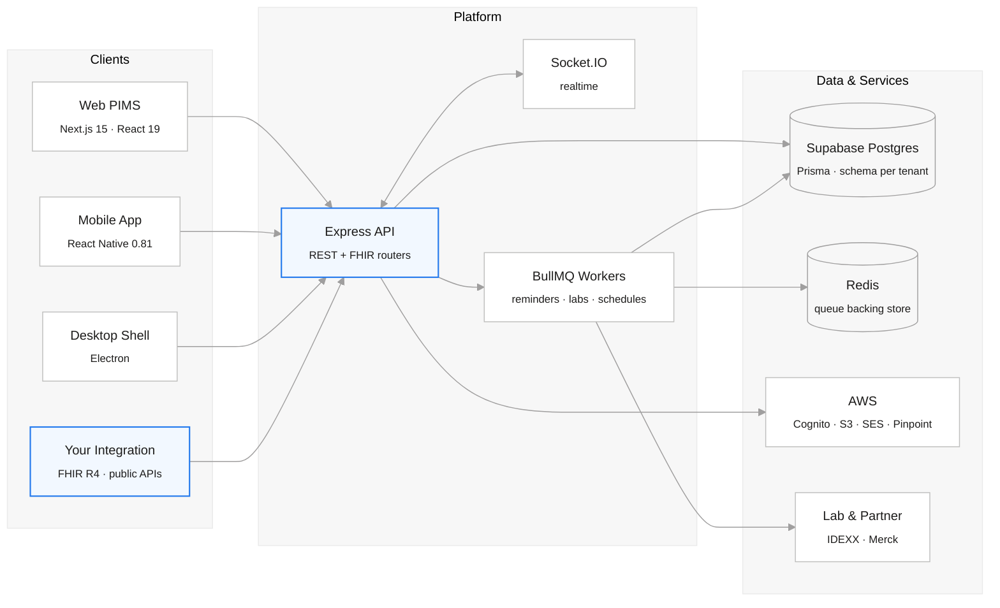

<p align="center">
  <a href="https://yosemitecrew.com/">
    
  </a>
</p>

<h1 align="center">Open-Source Operating System for Animal Health</h1>

<p align="center">
  <b>A free, fully customizable Practice Information Management System</b><br />
  and the open platform that grows around it.
</p>

<p align="center">
  Built for the clinics that carry animal health, the families who depend on them,<br />
  and the developers extending both.
</p>

<div align="center">

[](https://yosemitecrew.com/) [](https://github.com/YosemiteCrew/Yosemite-Crew/blob/main/CONTRIBUTING.md) [](https://github.com/YosemiteCrew/Yosemite-Crew/tree/main?tab=License-1-ov-file) [](https://www.figma.com/design/NAAV4XGcJ6FlGXGK68AUbp/Yosemite-Crew?node-id=0-1&t=qCMi0h3RReIRMkrK-1) [](https://discord.gg/SwM6mX85KD) [](https://deepwiki.com/YosemiteCrew/Yosemite-Crew)

</div>
<br>

https://github.com/user-attachments/assets/5c01ce0a-2c84-4200-85b5-96eff488e113

<br>

# 🔍 Code Quality (SonarCloud)

[](https://sonarcloud.io/summary/new_code?id=yosemitecrew_Yosemite-Crew_Frontend)

| Metric       | Backend                                                                                                                                                                                                                      | Platform (Frontend)                                                                                                                                                                                                            | Mobile App                                                                                                                                                                                                                           | Desktop                                                                                                                                                                                                                      |
| ------------ | ---------------------------------------------------------------------------------------------------------------------------------------------------------------------------------------------------------------------------- | ------------------------------------------------------------------------------------------------------------------------------------------------------------------------------------------------------------------------------ | ------------------------------------------------------------------------------------------------------------------------------------------------------------------------------------------------------------------------------------ | ---------------------------------------------------------------------------------------------------------------------------------------------------------------------------------------------------------------------------- |
| Quality Gate | [](https://sonarcloud.io/summary/new_code?id=yosemitecrew_Yosemite-Crew_Backend)      | [](https://sonarcloud.io/summary/new_code?id=yosemitecrew_Yosemite-Crew_Frontend)      | [](https://sonarcloud.io/summary/new_code?id=yosemitecrew_Yosemite-Crew_MobileAppYC)      | [](https://sonarcloud.io/summary/new_code?id=yosemitecrew_Yosemite-Crew_Desktop)      |
| Coverage     | [](https://sonarcloud.io/summary/new_code?id=yosemitecrew_Yosemite-Crew_Backend)                     | [](https://sonarcloud.io/summary/new_code?id=yosemitecrew_Yosemite-Crew_Frontend)                     | [](https://sonarcloud.io/summary/new_code?id=yosemitecrew_Yosemite-Crew_MobileAppYC)                     | [](https://sonarcloud.io/summary/new_code?id=yosemitecrew_Yosemite-Crew_Desktop)                     |
| Bugs         | [](https://sonarcloud.io/summary/new_code?id=yosemitecrew_Yosemite-Crew_Backend)                             | [](https://sonarcloud.io/summary/new_code?id=yosemitecrew_Yosemite-Crew_Frontend)                             | [](https://sonarcloud.io/summary/new_code?id=yosemitecrew_Yosemite-Crew_MobileAppYC)                             | [](https://sonarcloud.io/summary/new_code?id=yosemitecrew_Yosemite-Crew_Desktop)                             |
| Code Smells  | [](https://sonarcloud.io/summary/new_code?id=yosemitecrew_Yosemite-Crew_Backend)               | [](https://sonarcloud.io/summary/new_code?id=yosemitecrew_Yosemite-Crew_Frontend)               | [](https://sonarcloud.io/summary/new_code?id=yosemitecrew_Yosemite-Crew_MobileAppYC)               | [](https://sonarcloud.io/summary/new_code?id=yosemitecrew_Yosemite-Crew_Desktop)               |
| Reliability  | [](https://sonarcloud.io/summary/new_code?id=yosemitecrew_Yosemite-Crew_Backend) | [](https://sonarcloud.io/summary/new_code?id=yosemitecrew_Yosemite-Crew_Frontend) | [](https://sonarcloud.io/summary/new_code?id=yosemitecrew_Yosemite-Crew_MobileAppYC) | [](https://sonarcloud.io/summary/new_code?id=yosemitecrew_Yosemite-Crew_Desktop) |

# 📖 Contents

- [Overview](#-overview)
- [Who It Is For](#-who-it-is-for)
- [Architecture](#-architecture)
- [Inside the Monorepo](#-inside-the-monorepo)
- [Installation](#-installation)
- [Our Tech Stack](#-our-tech-stack)
- [Engineering Quality](#-engineering-quality)
- [Documentation](#-documentation)
- [Dev Environment Access](#-dev-environment-access)
- [Join Our Growing Community](#-join-our-growing-community)
- [License](#-license)

<br>

# 📝 Overview

Yosemite Crew is an open-source operating system for the animal health industry. At its core is a free, fully customizable Practice Information Management System (PIMS) that unifies pet care operations, bringing together pet owners, pet businesses, and developers into one ecosystem.

Most veterinary software asks a clinic to bend around the vendor: rigid subscriptions, closed data, and a roadmap someone else owns. Yosemite Crew inverts that. The clinical record is yours, the schema is open, the integration surface speaks [FHIR R4](https://hl7.org/fhir/R4/), and the entire platform is yours to fork, extend, or run yourself.

It is one monorepo spanning four products: a web PIMS for clinics, a mobile app for pet parents, a desktop shell, and a developer platform.

<br>

# 👥 Who It Is For

<table>
<tr>
<td width="33%" valign="top">

### 🐾 Pet Owners

**Ultimate convenience.** A mobile app to schedule appointments, hold virtual consultations, manage health records, and reach a library of care resources.

**Enhanced accessibility.** Whether in remote locations or facing mobility challenges, quality veterinary care stays reachable anytime, anywhere.

</td>
<td width="33%" valign="top">

### 🏥 Clinics & Providers

**Streamlined efficiency.** Scheduling and communication that cut administrative load instead of adding to it.

**Customization & integration.** Open source means no rigid subscription lock-in, and a system you can shape to how your practice actually works.

**Security & compliance.** Comprehensive data management, reporting, and adherence to regulatory standards.

**Scalability & support.** Built to grow with your practice, backed by regular updates and a community of contributors.

</td>
<td width="33%" valign="top">

### 💻 Developers

**Empowering innovation.** A developer portal at the heart of an ecosystem that mirrors the versatility of the WordPress plugin model.

**Flexible environment.** Public APIs, documentation, and ready-to-use templates for building and managing plugins that extend the core.

**Community-driven growth.** A collaborative environment where contributors keep expanding what veterinary care software can do.

</td>
</tr>
</table>

<br>

# 🏛 Architecture

Four clients, one API, one source of truth. Every product in the repo speaks to the same Express service and the same Postgres schema.



**Postgres is the source of truth.** Prisma Migrate owns the schema, and tenant data is isolated by Postgres schema rather than by a filter column, so one clinic's records cannot leak into another's through a forgotten `WHERE`. See [ADR 0001](./docs/adr/0001-postgres-prisma-source-of-truth.md).

**FHIR R4 is a first-class surface,** not an export button. Clinical artifacts, tasks, templates, and rendered documents have FHIR-shaped routes, so an integrator can talk to Yosemite Crew in a vocabulary the wider health ecosystem already speaks.

<br>

# 🗂 Inside the Monorepo

A pnpm + Turborepo workspace. Apps ship; packages are the shared spine underneath them.

### Apps

| App                | What it is                                                                                              |
| ------------------ | ------------------------------------------------------------------------------------------------------- |
| `apps/frontend`    | The web PIMS. Next.js 15, React 19, Zustand, Storybook, Playwright end-to-end and accessibility suites. |
| `apps/backend`     | The API. Express 4 on TypeScript, Prisma, Socket.IO realtime, BullMQ workers, Stripe.                   |
| `apps/mobileAppYC` | The pet parent app. React Native 0.81, Redux, i18next localization, Detox end-to-end.                   |
| `apps/desktop`     | The desktop shell. Electron, packaged by electron-builder, notarized, with auto-update.                 |
| `apps/dev-docs`    | The developer documentation site. Docusaurus.                                                           |

### Packages

| Package                        | What it holds                                                                 |
| ------------------------------ | ----------------------------------------------------------------------------- |
| `@yosemite-crew/database`      | The Prisma schema and migrations. The schema source of truth.                 |
| `@yosemite-crew/auth`          | Provider-independent session boundary built on SuperTokens.                   |
| `@yosemite-crew/types`         | Shared domain and form types across web, mobile, and API.                     |
| `@yosemite-crew/fhir`          | FHIR R4 helpers.                                                              |
| `@yosemite-crew/fhirtypes`     | FHIR R4 resource type definitions.                                            |
| `@yosemite-crew/design-tokens` | Semantic design tokens shared by web and mobile. Intent, not platform detail. |
| `@yosemite-crew/lib`           | Cross-workspace utilities.                                                    |

<br>

# 💻 Installation

### Prerequisites

- Git
- Node.js 20 (see [`.nvmrc`](./.nvmrc))
- pnpm 8

### Steps

- Create a fork from Yosemite-Crew repository as it is described in GitHub docs. You can skip this step if you want to just run the project and not contribute.
- Clone your forked repository to your local machine using `git clone`. Clone dev branch if want to use the bleeding edge version.

  ```shell
  git clone https://github.com/yourusername/Yosemite-Crew.git
  git clone -b dev https://github.com/yourusername/Yosemite-Crew.git

  cd Yosemite-Crew
  ```

- Install the project dependencies.

  ```shell
  pnpm install
  ```

- Git hooks are installed automatically during `pnpm install` (Husky + commitlint + lint-staged + secret scanning).

- Configure environment variables for the API and web app. Each ships an example file to copy and fill in:

  ```shell
  cp apps/backend/.env.example apps/backend/.env
  cp apps/frontend/.env.example apps/frontend/.env
  ```

  The backend needs a reachable database on boot. [`apps/backend/README.md`](./apps/backend/README.md) documents the startup requirements, including the legacy MongoDB connection that `READ_FROM_POSTGRES=true` bypasses, and Redis for the background job queues.

- Run the website and api.

  ```shell
  pnpm run dev --filter frontend                   -- Run the web app
  pnpm run dev --filter backend                    -- Run the backend API
  pnpm run dev                                     -- To run website & api
  ```

- Run the Yosemite Crew mobile app. The mobile app does not load `.env` files. It needs its own configuration (a `variables.local.ts`, Amplify outputs, and native Firebase and credential files copied from [`apps/mobileAppYC/config-templates/`](./apps/mobileAppYC/config-templates)). Follow the setup in [`apps/mobileAppYC/README.md`](./apps/mobileAppYC/README.md) before running.

  ```shell
  // In apps/mobileAppYC directory

  pnpm run start                                  -- Start the metro server for mobile development
  pnpm run android                                -- Run the app on Android
  pnpm run ios                                    -- Run the app on iOS
  ```

- Before opening a pull request, run the same gates CI will run.

  ```shell
  pnpm run verify                                 -- lint + type-check + test + build
  ```

<br>

# 🚀 Our Tech Stack

- [TypeScript](https://www.typescriptlang.org/) for type safety
- [Turborepo](https://turbo.build) and [PNPM Workspaces](https://pnpm.io/workspaces) for a powerful monorepo structure and efficient build system
- [Express](https://expressjs.com/) as a backend framework, with [Supabase](https://supabase.com/) Postgres and [Prisma](https://www.prisma.io/) for data storage and migrations
- [BullMQ](https://docs.bullmq.io/) on [Redis](https://redis.io/) for background jobs, and [Socket.IO](https://socket.io/) for realtime updates
- [Next.js](https://nextjs.org/) and [React](https://reactjs.org/) for the frontend, with [Zustand](https://zustand.docs.pmnd.rs/) for state management
- [React Native](https://reactnative.dev/) for mobile app development, and [Electron](https://www.electronjs.org/) for the desktop shell
- [FHIR R4](https://hl7.org/fhir/R4/) for clinical interoperability
- [Stripe](https://stripe.com/) for payments
- [AWS](https://aws.amazon.com) to ensure reliable and scalable cloud infrastructure

<br>

# ✅ Engineering Quality

Open source is a promise about how the code is kept, not only about who can read it. Every change entering `dev` passes the same gates.

| Gate                | What it enforces                                                                                             |
| ------------------- | ------------------------------------------------------------------------------------------------------------ |
| **Static analysis** | SonarCloud quality gate per app (see the table above), plus CodeQL scanning.                                 |
| **Types & lint**    | Repo-wide `type-check` and `lint`, enforced again on pre-push.                                               |
| **Tests**           | Unit and component suites per workspace, with coverage held on touched files.                                |
| **Accessibility**   | A dedicated accessibility suite and Playwright a11y run on the web app.                                      |
| **End-to-end**      | Playwright on the web app, enforced in CI. A Detox harness is available for the mobile app and runs locally. |
| **Visual review**   | Storybook and Chromatic for the component library.                                                           |
| **Supply chain**    | Dependency review, secret scanning, and staged-secret checks on every commit.                                |
| **Governance**      | Conventional commits and PR title validation.                                                                |

- Contributor workflow: [CONTRIBUTING.md](./CONTRIBUTING.md)
- Security reporting: [SECURITY.md](./SECURITY.md)
- Engineering standards: [docs/engineering-standards.md](./docs/engineering-standards.md)
- Architecture decisions: [docs/adr](./docs/adr)
- AI/automation contribution policy: [AGENTS.md](./AGENTS.md)

<br>

# 📚 Documentation

| Where                                                                  | What you will find                                      |
| ---------------------------------------------------------------------- | ------------------------------------------------------- |
| [Developer docs](./apps/dev-docs)                                      | The Docusaurus site for platform and API documentation. |
| [Engineering wiki](https://github.com/YosemiteCrew/Yosemite-Crew/wiki) | The structured engineering knowledge base.              |
| [Architecture guides](./docs/guide)                                    | PIMS architecture, realtime, notifications, analytics.  |
| [Architecture decisions](./docs/adr)                                   | The record of why the platform is shaped as it is.      |
| [DeepWiki](https://deepwiki.com/YosemiteCrew/Yosemite-Crew)            | An AI-generated tour of the codebase.                   |

<br>

# 🔑 Dev Environment Access

Request current dev or staging access from the maintainers through a secure channel. Do not publish shared credentials in repository documentation.

<br>

# 💬 Join Our Growing Community

- Star our repo and show your support!
- [Tik-tok](https://www.tiktok.com/@yosemitecrew) and [Instagram](https://www.instagram.com/yosemite_crew) for memes
- Follow us on [LinkedIn](https://www.linkedin.com/company/yosemitecrew/) to get all the latest news
- Join our [Discord](https://discord.com/invite/SwM6mX85KD) to chat with fellow contributors and users
- [Contribute](https://github.com/YosemiteCrew/Yosemite-Crew/blob/main/CONTRIBUTING.md) - we love contributions! Whether it's code, docs, or ideas, your help is always welcome!

<br>

# 📜 License

Yosemite Crew is released under the **GNU Affero General Public License v3.0**, with a Yosemite Crew licensing exception that permits combining the program with works under CC-BY-3.0 and CC-BY-4.0.

The YOSEMITE CREW name, logo, and branding are **not** covered by the open source license. Commercial use of the branding requires a separate commercial license. See [License.txt](./License.txt) for the full terms.

<br>

# ⭐ Star History

<a href="https://star-history.com/#YosemiteCrew/Yosemite-Crew&Date">
 <picture>
   <source media="(prefers-color-scheme: dark)" srcset="https://api.star-history.com/svg?repos=YosemiteCrew/Yosemite-Crew&type=Date&theme=dark" />
   <source media="(prefers-color-scheme: light)" srcset="https://api.star-history.com/svg?repos=YosemiteCrew/Yosemite-Crew&type=Date" />
   
 </picture>
</a>

# Thanks to the community!

## ✨ Contributors

Thanks to everyone who has contributed to Yosemite Crew!

<a href="https://github.com/YosemiteCrew/Yosemite-Crew/graphs/contributors">
  
</a>

## ⭐ Stargazers &nbsp;·&nbsp; 🍴 Forkers

See the [growth over time](#-star-history) above. Browse everyone who starred or forked the project:

- ⭐ [View all Stargazers](https://github.com/YosemiteCrew/Yosemite-Crew/stargazers)
- 🍴 [View all Forkers](https://github.com/YosemiteCrew/Yosemite-Crew/network/members)
